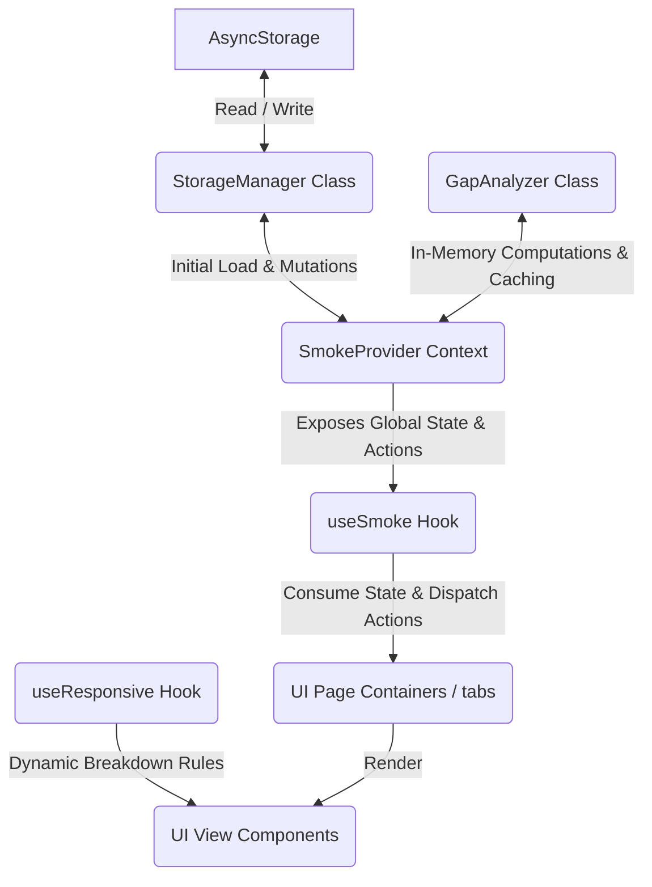

# SmokeLog Technical Architecture

This document describes the technical design, data flow, architecture layers, and performance optimization guidelines of the **SmokeLog** application.

---

## 1. System Overview

SmokeLog is built on **Expo (React Native)** using **TypeScript**. It is designed with a unidirectional data flow architecture where state is fetched from persistent storage on startup, managed globally via a React Context Provider, and consumed by presentation-only components.



---

## 2. Core Architectural Layers

The codebase is organized into five functional layers:

### A. Presentation Layer (UI Container & Layout Component Separation)
To ensure high readability and maintainability, the Presentation Layer is split into two parts:
1. **Page Containers (`src/app/`)**: Screen files under the `(tabs)` directory act strictly as drivers. They fetch state from custom hooks, orchestrate local modal states, and delegate markup rendering.
2. **Layout Components (`src/components/`)**: Stored in subfolders named after the screens they belong to (e.g. `tracker/`, `dashboard/`). These components focus purely on visual markup, receiving data and callbacks through TypeScript props.

### B. Custom Hooks Layer (`src/hooks/`)
Exposes shared state hooks and layout utilities to decoupling components from direct context dependencies:
* **`useSmoke`**: Interfaces with the `SmokeContext` to fetch metrics, triggers, and state mutation methods.
* **`useResponsive`**: Interacts with React Native's `useWindowDimensions` to deliver orientation metrics and scaling values, adapting layouts dynamically between mobile, tablet, and wide screens.

### C. State Management Layer (`src/context/`)
* **`SmokeContext.tsx`**: Wraps the root of the application inside `_layout.tsx`. It hosts states for user settings, logs, and craving sessions, updates elapsed counters via background timers, and coordinates updates between local storage and in-memory caches.

### D. Business Logic & Analytics Layer (`src/utils/gapAnalysis.ts`)
* **`GapAnalyzer`**: A class-based utility containing the algorithmic computations for habit analysis. It processes the raw timestamp array to generate gap structures, trigger distribution charts, and user habit trajectory scores.
* **In-Memory Caching**: To protect against render-time CPU spikes, it caches chronological sorts and calculated metrics inside private fields during instantiation, minimizing memory allocation pressure.

### E. Persistence Layer (`src/utils/storage.ts`)
* **`StorageManager`**: A static utility class enclosing AsyncStorage namespaces. It handles serialization/deserialization of baseline settings, skipped cigarettes, and mindfulness records.

---

## 3. Data Mutation & Calculation Flows

### A. Initial Boot Flow
1. **Context Mount**: `SmokeProvider` initializes `loading` state to `true`.
2. **Parallel Fetch**: `Promise.all` executes static methods in `StorageManager` to load settings, logs, and craving sessions from local disk.
3. **Context Update**: Retrieved entries are set to React state, and `loading` is set to `false`.
4. **Timer Initialization**: The elapsed timer determines the offset since the newest log and registers a background interval updates.

### B. Logging a Cigarette
```
[User Clicks Log Button] 
       │
       ▼
[Instantiate Temp GapAnalyzer] ──► Evaluates new log timestamp against previous averages
       │
       ▼
[Invoke StorageManager.addLog] ──► Writes updated JSON string to AsyncStorage
       │
       ▼
[Update Local Context State]   ──► Triggers useMemo updates on the main GapAnalyzer
       │
       ▼
[Reset Elapsed Timer Offset]   ──► Tab screens re-render with new trajectory feedback
```

### C. Breathing Exercise Lifecycle
1. **Start Exercise**: Invoking `startBreathingExercise` spawns a box breathing sequence with Reanimated spring animations and stores the `setInterval` handle inside a `useRef` reference.
2. **In-Progress Tick**: The interval updates the remaining timer state every second and switches phase flags ("inhale", "hold", "exhale").
3. **Synchronous Clean**: On cancel, completion, or component unmount, `clearInterval` is invoked synchronously on the `useRef` handle, completely eliminating background thread leaks.

---

## 4. Key Performance & Optimization Rules

* **React Garbage Collection (GC) Optimization**: The application avoids stateless array sorting or mapping directly in render blocks. All array derivations in the context are wrapped in React `useMemo` hooks using cached methods in the `GapAnalyzer` class.
* **Safe Area Layouts**: The bottom tab bar styling in `src/app/(tabs)/_layout.tsx` dynamically polls Safe Area insets from `react-native-safe-area-context` using the formula:
  * `height: 54 + Math.max(insets.bottom, 8)`
  * `paddingBottom: Math.max(insets.bottom, 6)`
  This prevents overlapping issues with system gesture indicators on modern iOS and Android displays.
* **Dynamic Columns on Large Viewports**: Page layout sheets apply grid rules using the `useResponsive` hook. On wide displays (iPad/tablet/web), double-column row configurations are automatically enabled, while forms are centered with a readable maximum width constraint.
